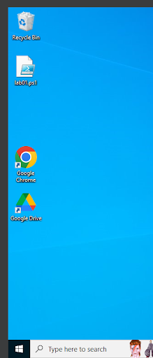
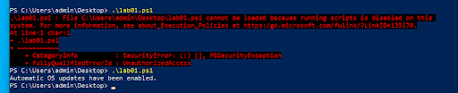
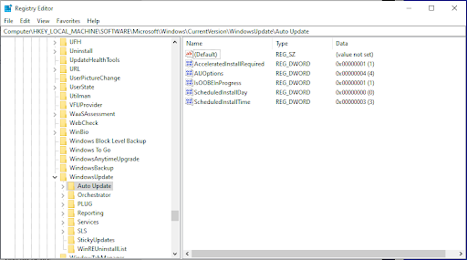

## Lab: Strategic Policy Development

### Overview

Compliance requirements are often a critical business driver for adopting new cybersecurity policies, procedures, and systems. One such compliance standard is System and Organization Controls (SOC) 2. Modern security professionals must be familiar with common industry frameworks and compliance standards, and be prepared to align security operations accordingly.

### Scenario

Your MSSP has recently accepted a new client, a five year-old startup SaaS company called "Initrobe." Initrobe is looking to expand operations and build new partnerships. Increasingly, however, customers are inquiring about Initrobe's security practices (doing their proper due diligence when assessing third-party vendors). The Initrobe CTO is busy growing her engineering and product team, and brought your company in to assess the security landscape, make recommendations, and create and implement Initrobe's security policy and strategy.

Initrobe is a fully remote company with a distributed workforce across the US, and it relies heavily upon cloud IaaS technologies, as well as third-party SaaS and PaaS. There is no IT department (you and the head of HR will coordinate hiring and termination needs).

Initrobe is looking to pursue a SOC 2 Type 2 audit this year. It's now your job to identify vulnerabilities, gaps, and tasks ahead as you tighten up security and prepare for a SOC 2 audit. After reviewing the company’s services and business processes, you’ve gathered the below notes.

Employees

* HRIS - Gusto
* 80 Employees (expected to hire 30 more this year!)
* 25 Contractors (1099)

Domain - Initrobe.com

* Google Workspace is the email and identity agent.
* Employees - Each employee is assigned an email address with the following format firstname.lastname@initrobe.com.
* Contractors - Most contractors are assigned an email address with the following format v-firstname.lastname@initrobe.com but many are using personal emails, some are sharing a single log-in for Initrobe access.

IT Resources

* Fully remote, no on-premise resources
* No hardware inventory
* No software inventory
* No security awareness training
* No mobile device management (MDM) software
* Employees are using a mix of personal computers & company computers (and personal cell phones); primarily macOS fleet, with a few Windows machines, and even fewer Linux boxes (engineering team only).
* Contractors are using personal computers.

Security/data policies in existence:

* Data Security Acknowledgement
* Laptop Lending Form (for employees receiving company laptops)

Among other gaps, there are no formal Incident Response, Business Continuity, and no recovery plans. Furthermore, Initrobe lacks a consolidated or centralized program for management and access or usage audit for remaining ad-hoc assortment of additional vendors and tools (Zoom, Salesforce, Shortcut, Adobe, Microsoft Office) that some people have access and/or admin rights to.

Major tools

* Google Workspace for email and Drive (no password requirements or MFA enforced)
* AWS and Heroku for PaaS needs
* Slack for internal communication
* [Slab](https://slab.com/){:target="_blank"} for internal documents (i.e. Employee Handbook, policies, procedures)
* Google Docs (shared drive) used for additional company documents
* Internal application access (to Initron, the software platform sold by Initrobe), Google Workspace credentials serve as SSO
* Gusto - HRIS (complete with org chart)
* Application (Initrobe's SaaS product, Initron, which is web, iOS, and Android)
* MFA required for platform and source-code access (Heroku, AWS, GitHub)
* Slack notifications to engineering team for critical bugs and vulnerabilities
* [Shortcut project management](https://shortcut.com/){:target="_blank"} and ticketing system
* Static & dynamic analysis of applications conducted periodically

SOC 2 compliance will require all computers configured as follows:

* Encrypted hard drive
* Automatic screen lock
* Antivirus installed and scanning
* Automatic OS updates enabled
* Configured to use a password manager application

### Objectives

* Using the provided templates, create the following deliverables:
    * Security Architecture Narrative
        * The narrative should describe the current state of Initrobe's security practices and their liabilities/weaknesses.
    * Information Security Policy
    * Employee Onboarding Procedure
    * Employee Offboarding Procedure
* Create a shell script that automates ONE of the following required SOC 2 configurations on a Windows 10 endpoint.
    * Automatic screen lock
    * Antivirus installed and scanning
    * Automatic OS updates enabled

### Resources

* [SOC 2 Policy Docs Template](https://docs.google.com/document/d/11llh6dLRYYKIKptSA_RX1Siu4D8KvD6_63uNnDsT5N8/edit){:target="_blank"}
* [SOC 2 Compliance Requirements](https://secureframe.com/hub/soc-2/requirements){:target="_blank"}

### Tasks

#### Part 1: SOC 2 Deliverables

1. Start by carefully reviewing the scenario.
2. Access the provided template and create a copy by clicking on File > Make a copy
3. Customize the deliverables for today in accordance with the scenario and SOC 2 requirements
    1. Security Architecture Narrative
    2. Employee Onboarding Procedure
    3. Employee Offboarding Procedure
    4. Information Security Policy
        1. Acceptable Use Policy
        2. Disaster Recovery Policy
        3. Password Policy
        4. Remote Access Policy
        5. Workstation Policy

**Here is a link to my document: **[https://docs.google.com/document/d/1_nYf0YYEAyKoIU6y6sBAbjCGYPOiUpIkU1QlPnsEq9Y/edit?usp=sharing](https://docs.google.com/document/d/1_nYf0YYEAyKoIU6y6sBAbjCGYPOiUpIkU1QlPnsEq9Y/edit?usp=sharing)

#### Part 2: Automating Workstation Configuration

1. Select a shell script objective for yourself.
    1. Enable Automatic OS Updates
2. Write a PowerShell script that achieves the target objective.
3. My script is below, it is updating the AUOptions, ScheduledInstallDay and ScheduledInstallTime.

[https://github.com/Z-Zachattack/Ops-401/blob/main/lab01.ps1](https://github.com/Z-Zachattack/Ops-401/blob/main/lab01.ps1)

---

**# Script Name:                  			lab01.ps1**

**# Author:                       			Zachariah Woodbridge**

**# Date of latest revision:      		08 Jan 2024**

**# Purpose:                      			powershell script that automates windows updates**

**#Thanks to chat gpt that taught me how to do all of this.**

**# Main**

**# PowerShell script to enable Automatic OS updates**

**# Define the registry path for Windows Update settings**

**$registryPath = "HKLM:\SOFTWARE\Microsoft\Windows\CurrentVersion\WindowsUpdate\Auto Update"**

**# Define the registry values to enable automatic updates**

**$registryValues = @{**

**# Set AUOptions to 4 for automatic updates**

**"AUOptions" = 4**

**# Set ScheduledInstallDay to 0 for every day**

**"ScheduledInstallDay" = 0  **

**# Set ScheduledInstallTime to 3 for 3:00 AM**

**"ScheduledInstallTime" = 3 }**

**# Set the registry values to enable automatic updates**

**foreach ($key in $registryValues.Keys) {**

**    Set-ItemProperty -Path $registryPath -Name $key -Value $registryValues[$key]**

**}**

**Write-Host "Automatic OS updates have been enabled."**

**# End**

---

Spun Up my VM, created my ps1 file and executed

Well the first execution didn’t work, but the second did! I had to go into updates and security and give myself permissions to execute scripts

Now lets check the registry and see if my settings stuck!

AUOptions… 4 **[X]**

ScheduledInstallDay = 0 **[X]**

ScheduledInstallTime = 3 **[X]**

---

## SOC2 Policies for Initrobe

## **Security Architecture Narrative**

Initrobe has implemented a comprehensive security architecture that aligns with the key control objectives outlined in the SOC 2 framework. Our security measures are designed to ensure the confidentiality, integrity, and availability of sensitive information and systems. The organization employs a combination of technical controls, access management, and regular assessments to meet the criteria set by SOC 2.

## **Initrobe Product Architecture**

Initrobe's product architecture prioritizes security by implementing measures such as multi-factor authentication (MFA) for platform and source-code access. The architecture is designed to safeguard customer data and ensure the resilience of our SaaS product, Initron, across web, iOS, and Android platforms. Regular static and dynamic analysis of applications is conducted to identify and address vulnerabilities promptly.

## **Initrobe Infrastructure**

### **Product Infrastructure**

Initrobe's product infrastructure relies on cloud services, specifically AWS and Heroku, for its platform-as-a-service (PaaS) needs. Access to these cloud services is restricted based on the principle of least privilege, and access reviews are conducted quarterly. The infrastructure is configured to meet SOC 2 compliance requirements, including encrypted hard drives, automatic screen lock, antivirus installation and scanning, automatic OS updates, and the use of a password manager application.

### **Authorized Personnel**

List the authorized people (CTO, System Admins, etc) within the system.

1. Chief Technology Officer (CTO) - Alex Johnson
2. System Administrators - John Smith, Sarah Davis
3. Security Analyst - Michael Rodriguez
4. IT Support Specialist - Emily Turner

### **IT Infrastructure**

Initrobe uses the following services for its internal infrastructure:

1. Google Workspace
2. AWS
3. Heroku
4. Slack

Access to these cloud services is limited according to the role of the employee and is reviewed quarterly as well as via regular onboarding/offboarding tasks for new and departing employees.

## **Initrobe Workstations**

Initrobe workstations are hardened against logical and physical attack by the following measures: 

1. Encrypted hard drive
2. Automatic screen lock
3. Antivirus installed and scanning
4. Automatic OS updates enabled
5. Configured to use a password manager application

Workstation compliance with these measures is evaluated on a quarterly basis.

### **Remote Access**

Many Initrobe employees work remotely on a regular basis and connect to production and internal IT systems via the same methods as those employees connecting from the Initrobe physical office, i.e., direct encrypted access to cloud services. It is the employee’s responsibility to ensure that only authorized personnel use Initrobe resources and access Initrobe systems.

### **Access Review**

Access to Initrobe infrastructure, both internal and product, is reviewed quarterly and inactive users are removed. Any anomalies are reported to the security team for further investigation. When employees start or depart, an onboarding/offboarding procedure is followed to provision or deprovision appropriate account access.

### **Penetration Testing**

Initrobe commissions an external penetration test on an annual basis. All findings are immediately reviewed and addressed to the satisfaction of the CTO/CEO.

## **Initrobe Physical Security**

Initrobe has one physical location, in San Francisco, CA (United States). Key issuance is tracked by the Office Physical Security Policy Ledger. Office keys are additionally held by the lessor, property management, and custodial staff. These keys are not tracked by the Office Physical Security Policy Ledger. Initrobe managers regularly review physical access privileges.

Initrobe infrastructure is located within AWS. Initrobe does not have physical access to AWS infrastructure.

## **Risk Assessment**

Initrobe updates its Cyber Risk Assessment on an annual basis in order to keep pace with the evolving threat landscape. The following is an inventory of adversarial and non-adversarial threats assessed to be of importance to Initrobe.

### **Adversarial Threats**

The following represents the inventory of adversarial threats:

1. Phishing attacks
2. DDoS attacks
3. Insider threats

### **Non-Adversarial Threats**

The following represents the inventory of non-adversarial threats:

1. Power outages
2. Hardware failures
3. Natural disasters

## **Access Onboarding and Termination Policy**

#### **Purpose and Scope:**

The purpose of this policy is to define procedures to onboard and offboard users to  technical infrastructure in a manner that minimizes the risk of information loss or exposure. This policy applies to all technical infrastructure within the organization.This policy applies to all full-time and part-time employees and contractors.

#### **Background:**

1. In order to minimize the risk of information loss or exposure (from both inside and outside the organization), the organization is reliant on the principle of least privilege. 
2. Account creation and permission levels are restricted to only the resources absolutely needed to perform each person’s job duties. 
3. When a user’s role within the organization changes, those accounts and permission levels are changed/revoked to fit the new role and disabled when the user leaves the organization altogether.

#### **Policy**

1. _During onboarding:_
    1. **Employee Information Collection: **
        1. HR collects necessary information for user account creation.
        2. Required information includes full name, position, department, and contact details.
    2. **Account Provisioning:**
        3. HR submits a request to the IT team for the creation of the user account.
        4. IT team provisions access based on the employee's role and responsibilities.
        5. Standard accounts include Google Workspace, Slack, and other necessary tools.
    3. **Security Training:**
        6. New employees undergo mandatory security awareness training.
        7. Training includes data security practices, proper use of IT resources, and confidentiality guidelines.
    4. **Distribution of Security Policies:**
        8. New employees receive and acknowledge Data Security Acknowledgment and other relevant security policies.
2. _During offboarding:_
    5. **Employee Notification:**
        9. HR is notified of an employee's departure or termination.
    6. **Account Deactivation:**
        10. HR initiates the offboarding process, submitting requests to IT for account deactivation.
        11. Accounts include Google Workspace, Slack, and other relevant platforms.
    7. **Return of Company Assets:**
        12. HR coordinates with the exiting employee for the return of company assets, including laptops and access cards.
    8. **Exit Interview:**
        13. Conduct exit interviews to gather feedback and insights, including potential security concerns.
3. _When an employee changes roles within the organization:_
    9. **Notification:**
        14. HR notifies IT of any employee role changes within the organization.
    10. **Access Adjustment:**
        15. IT adjusts user access based on the employee's new role.
    11. Accounts are reviewed, modified, or revoked according to the principle of least privilege.
    12. **Re-training:**
        16. If the role change involves different security responsibilities, the employee undergoes additional training.
4. _Review of accounts and permissions:_
    13. **Regular Quarterly Review:**
        17. Conduct quarterly reviews of all employee accounts and permissions.
        18. Identify and rectify any discrepancies or unauthorized access promptly.
    14. **Onboarding/Offboarding Audits:**
        19. Onboard and offboard audits are performed as part of the regular review cycle.
        20. Ensure that new employees receive the necessary access, and departing employees have access promptly revoked.
    15. **Anomaly Reporting: **
        21. Any anomalies or suspicious activities identified during the review are reported to the security team for further investigation.
    16. **Documentation:**
        22. Maintain comprehensive documentation of account reviews and permission adjustments for auditing purposes.

## **Information Security Policy**

#### **Purpose and Scope**

1. This information security policy defines the purpose, principles, objectives and basic rules for information security management.
2. This document also defines procedures to implement high level information security protections within the organization, including definitions, procedures, responsibilities and performance measures (metrics and reporting mechanisms).
3. This policy applies to all users of information systems within the organization. This typically includes employees and contractors, as well as any external parties that come into contact with systems and information controlled by the organization (hereinafter referred to as “users”). This policy must be made readily available to all users.

#### **Background**

1. This policy defines the high level objectives and implementation instructions for the organization’s information security program. It includes the organization’s information security objectives and requirements; such objectives and requirements are to be referenced when setting detailed information security policy for other areas of the organization. This policy also defines management roles and responsibilities for the organization’s Information Security Management System (ISMS). Finally, this policy references all security controls implemented within the organization.
2. Within this document, the following definitions apply
    1. **_Confidentiality_**: a characteristic of information or information systems in which such information or systems are only available to authorized entities
    2. **_Integrity_**: a characteristic of information or information systems in which such information or systems may only be changed by authorized entities, and in an approved manner
    3. **_Availability_**: a characteristic of information or information systems in which such information or systems can be accessed by authorized entities whenever needed
    4. **_Information Security_**: the act of preserving the confidentiality, integrity, and availability of information and information systems
    5. **_Information Security Management System (ISMS)_**: the overall management process that includes the planning, implementation, maintenance, review, and improvement of information security

#### **Policy**

1. _Managing Information Security_
    1. The organization’s main objectives for information security include the following:
        1. **Protection of Customer Data: **Ensure the confidentiality, integrity, and availability of customer data stored and processed by Initrobe.
        2. **Compliance with Regulatory Standards:** Adhere to industry-specific regulations and legal requirements, including those relevant to SaaS providers.
        3. **Risk Mitigation:** Identify and mitigate potential security risks to safeguard the organization against data breaches and cyber threats.
        4. **Maintaining Business Continuity: **Establish robust security measures to ensure continuous business operations and minimize downtime in the face of security incidents.
        5. **Protection of Intellectual Property:** Safeguard Initrobe's intellectual property, including source code and proprietary information, from unauthorized access or theft.
        6. **Preserving Reputation:** Uphold a strong security posture to protect the company's reputation and build trust with customers, partners, and stakeholders.
        7. **Ensuring Secure Product Development:** Integrate security measures into the software development lifecycle to deliver secure and resilient products to customers.
        8. **Prevention of Unauthorized Access:** Implement access controls and authentication mechanisms to prevent unauthorized access to sensitive systems and information.
        9. **Security Awareness and Training:** Foster a culture of security awareness among employees through regular training programs and communication.
        10. **Incident Response Readiness:** Establish effective incident response procedures to promptly detect, respond to, and recover from security incidents.
        11. **Regular Security Assessments:** Conduct periodic security assessments, including penetration testing and vulnerability assessments, to identify and address potential weaknesses.
        12. **Vendor Risk Management:** Implement robust processes for evaluating and managing security risks associated with third-party vendors and partners.
        13. **Adaptation to Evolving Threat Landscape:** Stay vigilant and adapt security measures to address emerging threats and vulnerabilities in the dynamic cybersecurity landscape.
        14. **Security Governance and Oversight: **Establish clear governance structures and oversight mechanisms to ensure the effectiveness of information security policies and controls.
        15. **Enhancement of Security Controls:** Continuously enhance and update security controls to address new challenges and technological advancements.
        16. **Privacy Compliance:** Ensure compliance with privacy laws and regulations, safeguarding the privacy of customer and employee data.
        17. **Employee Accountability:** Foster a sense of accountability among employees for their role in maintaining information security and protecting organizational assets.
    2. The organization’s objectives for information security are in line with the organization’s business objectives, strategy, and plans.
    3. Objectives for individual security controls or groups of controls are proposed by the company management team, including but not limited to Chief Executive Officer (CEO), Chief Technology Officer (CTO), Chief Information Security Officer (CISO), System Administrators, and the Risk Management Team, and others as appointed by the CEO; these security controls are approved by the CEO in accordance with the Risk Assessment Policy.
    4. All objectives must be reviewed at least once per year.
    5. The company will measure the fulfillment of all objectives. The measurement will be performed at least once per year. The results must be analyzed, evaluated, and reported to the management team.
2. _Information Security Requirements_
    6. This policy and the entire information security program must be compliant with legal and regulatory requirements as well as with contractual obligations relevant to the organization.
    7. All employees, contractors, and other individuals subject to the organization’s information security policy must read and acknowledge all information security policies.
    8. The process of selecting information security controls and safeguards for the organization is defined in Reference (a).
    9. The organization prescribes guidelines for remote workers as part of the Remote Access Policy.
    10. To counter the risk of unauthorized access, the organization maintains a Data Center Security Policy.
    11. Security requirements for the software development life cycle, including system development, acquisition and maintenance are defined in the Software Development Lifecycle Policy.
    12. Security requirements for handling information security incidents are defined in the Security Incident Response Policy.
    13. Disaster recovery and business continuity management policy is defined in the Disaster Recovery Policy.
    14. Requirements for information system availability and redundancy are defined in the System Availability Policy.

### **Acceptable Use Policy**

#### **Purpose and Scope**

The purpose of this policy is to establish guidelines for the acceptable use of Initrobe's information systems and resources. It applies to all employees, contractors, and third parties granted access to Initrobe's systems.

#### **Background**

Initrobe recognizes the importance of ensuring that its information systems are used in a manner that aligns with business objectives, legal requirements, and ethical standards. This policy aims to define the acceptable use of company resources to maintain a secure and productive work environment.

**Policy**

1. **Authorized Use: **Users are authorized to access and use company resources for job-related activities. Any other use requires explicit approval.
2. **Data Protection: **Users must adhere to data protection laws and company policies when handling sensitive or confidential information.
3. **Prohibited Activities: **Users are prohibited from engaging in activities that may compromise the security or integrity of Initrobe's systems, including unauthorized access, data breaches, or malicious software installation.
4. **Internet and Email Usage: **Internet and email usage should be for business purposes. Personal use should be minimal and not interfere with work responsibilities.
5. **Software Installation: **Users are not allowed to install software on company devices without approval from the IT department.
6. **Resource Conservation:** Users should not engage in activities that consume excessive network bandwidth or storage resources, impacting the performance for others.
7. **Reporting Violations: **Users must promptly report any suspected policy violations or security incidents to the IT department.
8. **Consequences of Violations:** Violations of this policy may result in disciplinary actions, including termination, and legal consequences, if applicable.

### **Disaster Recovery Policy**

#### **Purpose and Scope**

#### This policy outlines Initrobe's approach to disaster recovery planning to ensure the continuity of business operations in the event of a disruptive incident. It applies to all employees, contractors, and stakeholders involved in business processes.

#### **Background **

#### Initrobe recognizes the importance of being prepared for potential disasters, whether natural or man-made, to minimize the impact on business operations. This policy is designed to provide a framework for effective disaster recovery planning and response.

#### **Policy**

1. **Risk Assessment:** Initrobe will conduct regular risk assessments to identify potential threats and vulnerabilities that could impact business operations.
2. **Data Backup and Storage: **Critical data will be regularly backed up, and backup copies will be stored securely at an offsite location.
3. **Disaster Recovery Team: **A dedicated disaster recovery team will be identified and trained to respond effectively to incidents.
4. **Communication Plan: **A communication plan will be established to ensure timely and accurate communication during and after a disaster.
5. **Testing and Training: **Regular testing and training exercises will be conducted to evaluate the effectiveness of the disaster recovery plan and improve response capabilities.
6. **Documentation: **All aspects of the disaster recovery plan, including procedures and responsibilities, will be thoroughly documented and kept up to date.
7. **Equipment and Resources: **Adequate equipment and resources required for disaster recovery will be identified, maintained, and periodically tested.
8. **Coordination with External Entities:** Initrobe will coordinate with external entities, such as emergency services and vendors, to enhance the effectiveness of the disaster recovery plan.

### **Password Policy**

#### **Purpose and Scope**

#### The purpose of this policy is to establish guidelines for creating, managing, and securing passwords used to access Initrobe's information systems. It applies to all employees, contractors, and third parties with access to Initrobe's systems.

#### **Background**

#### Passwords are a critical component of information security. This policy is designed to ensure the use of strong passwords and proper password management practices to protect sensitive data and systems.

#### **Policy**

1. **Password Complexity:** Passwords must meet minimum complexity requirements, including a combination of uppercase, lowercase, numbers, and special characters.
2. **Password Change Frequency: **Users must change their passwords regularly, as defined by the password management system.
3. **Unique Passwords: **Users are prohibited from using the same password for multiple accounts.
4. **Password Storage: **Passwords must not be stored in plain text, and secure password management tools should be used where applicable.
5. **Authentication Factors:** Multi-factor authentication (MFA) should be enabled where possible to enhance account security.
6. **Password Sharing: **Users are strictly prohibited from sharing passwords with others.
7. Reporting Suspicious Activity: Users must report any suspicious activity related to passwords or unauthorized access immediately.
8. **Account Lockout: **Account lockout mechanisms will be implemented after a specified number of failed login attempts.

### **Remote Access Policy**

#### **Purpose and Scope**

#### This policy outlines the guidelines and procedures for remote access to Initrobe's information systems. It applies to all employees, contractors, and third parties requiring remote access.

#### **Background**

#### As a fully remote company, providing secure and controlled remote access is crucial. This policy is designed to ensure the confidentiality and integrity of data accessed remotely.

#### **Policy**

1. **Authorized Remote Access: **Remote access to company systems is authorized only for job-related activities and requires approval.
2. **Secure Connection: **Remote connections must be established using secure and encrypted protocols, such as VPNs, to protect data during transmission.
3. **Authentication: **Users accessing company systems remotely must authenticate using secure methods, including passwords and multi-factor authentication.
4. **Endpoint Security:** Devices used for remote access must comply with Initrobe's security standards, including antivirus software, encryption, and regular updates.
5. **Remote Access Review: **Remote access permissions will be regularly reviewed and adjusted based on job responsibilities.
6. **Reporting Lost or Stolen Devices:** Users must promptly report lost or stolen devices used for remote access to the IT department.
7. **Termination of Remote Access:** Remote access privileges will be promptly revoked upon termination of employment or contract.

### **Workstation Policy**

#### **Purpose and Scope**

This policy defines the standards and guidelines for securing workstations used by Initrobe employees and contractors. It applies to all devices connected to Initrobe's network.

#### **Background**

Workstations are a critical component of Initrobe's information infrastructure. This policy aims to ensure the secure configuration and use of workstations to protect against potential threats.

#### **Policy**

1. **Encryption and Security Software: **Workstations must have full-disk encryption, antivirus software, and other security tools as defined by Initrobe's security standards.
2. **Automatic Updates: **Operating systems and software on workstations must have automatic updates enabled to ensure the latest security patches.
3. **Password Protection: **Workstations must be password-protected, and users should lock their workstations when leaving them unattended.
4. **Access Controls:** User access on workstations should be restricted based on job responsibilities. Administrative privileges must be granted judiciously.
5. **Physical Security:** Workstations should be physically secured, and users must not leave workstations unattended in public areas.
6. **Unauthorized Software: **Users are prohibited from installing unauthorized software on workstations.
7. **Data Backup:** Critical data on workstations should be regularly backed up to prevent data loss in case of hardware failure.
8. **Reporting Security Incidents: **Users must report any security incidents or suspicious activities related to workstations promptly.
* ChatGPT was used.